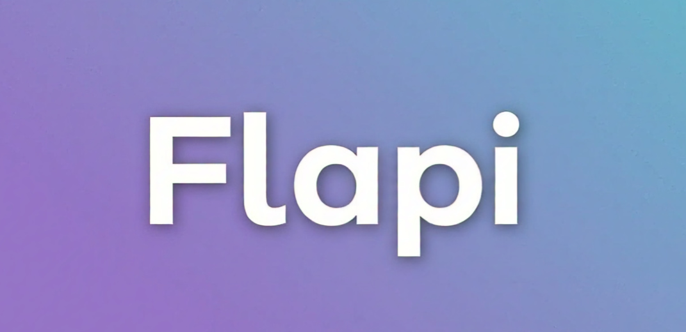

# Flapi
[](https://github.com/sponsors/hunter87ff)  

[](#)
[](#)


Flapi (derived from "Fill API" term) is a free-to-use service tailored for frontend developers. It generates mock data effortlessly based on your custom schemas, speeding up your workflow and simplifying development.

## Why Flapi?

**Fully Customizable Data:** Define your schema, and Flapi fills it in no time.

**Dynamic Multi-Response:** Flapi can generate different responses for the same schema in one call (amount parameter).

**Frontend-Centric Design:** Build and test interfaces without backend dependencies.

**Completely Free:** Designed with developers in mind to make their lives easier.

**Let Flapi fill your API needs for mock data and take your development to the next level!**


<details>
<summary>Example Python Code</summary>

```python

import requests

response = requests.get(
    "https://flapi.sprucbot.tech/v1/gen?amount=2", 
    json={
        "name" : "name()",
        "email" : "email(domain=hg.co)",
        "age" : "age(min=78$max=200)",
        "address" : "address()",
        "created_at" : "date()",
        "phone" : "phone(code=87)",
        "ids" : "list-int(amount=3$max=2)",
        "employee" : {
            "_$amount" : 1,
            "name" : "name()",
            "position" : "text(len=5)",
            "clients" : {
                "_$amount" : 2,
                "deal" : "int(len=5)",
                "name" : "name()",
                "email" : "email(domain=hg.co)"
            }
        }
    }
)

if response.status_code == 200:
    data = response.json()
    print(data)
else:
    print(f"Error: {response.status_code}")

```

</details>


## Example Schema - Response

**Endpoint**
> /v1/gen?amount=2

**Schema**
```json
{
  "name" : "name()",
  "email" : "email(domain=hg.co)",
  "age" : "age(min=78$max=200)",
  "address" : "address()",
  "created_at" : "date()",
  "phone" : "phone(code=87)",
  "ids" : "list-int(amount=3$max=2)",
  "employee" : {
    "_$amount" : 1,
    "name" : "name()",
    "position" : "text(len=5)",
    "clients" : {
        "_$amount" : 2,
        "deal" : "int(len=5)",
        "name" : "name()",
        "email" : "email(domain=hg.co)"
    }
  }
}
```

<details>
<summary>Response</summary>

```json
{
  "name": "Jennifer Huynh",
  "email": "kristenturner@hg.co",
  "age": 125,
  "address": "959 Holden Corner Apt. 103\nEast Matthew, IN 93214",
  "created_at": "18-12-2003",
  "phone": "+87-9487346280",
  "ids": [1,2,1],
  "employee": [
    {
      "_$amount": 1,
      "name": "Jason Hartman",
      "position": "PM.",
      "clients": [
        {
          "_$amount": 2,
          "deal": 55503,
          "name": "Nicole Parker",
          "email": "yhopkins@hg.co"
        },
        {
          "_$amount": 2,
          "deal": 35965,
          "name": "Mark Thomas",
          "email": "kirsten79@hg.co"
        }
      ]
    }
  ]
}
```
</details>


## Alternatives to Flapi

### 1. Mockaroo

Allows schema-based data generation.

Has a GUI to define schemas but is not API-first and limited without a paid plan.


### 2. JSONPlaceholder

Provides static, pre-defined mock data.

Cannot generate dynamic data based on custom schemas.


### 3. QuickMocker

API mocking platform.

Focused on mocking responses, not dynamic data generation.
